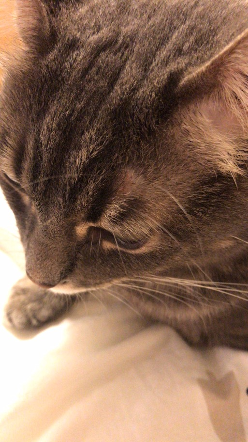

# Picture of my daily supporter:

## About me
 Hey! My name is Zhenyi Chen. I am a **senior math-computer science student** and I transferred to UCSD last fall. I decided to double major in **Cognitive Science speacialized in Neural Computation and Machine earning** this summer so I have to extend my graduation year to 2023. I plan to have an internship or work for a while before applying for the graduat school with clear researching field.
## As a programmer
 I started to code using python in high school. I learnt Cpp in college when I was a freshman and Java in sophomore. I tried to practive more in my spare time but it seems that taking classes is the most efficient way to practice coding. I know that I have to pratice more often but hard to keep up... :(
## Hobbies
I like to watch movies, play tennis and have a fun time with my friends and cats. I love to on the move, no matter in physical or in mind!
